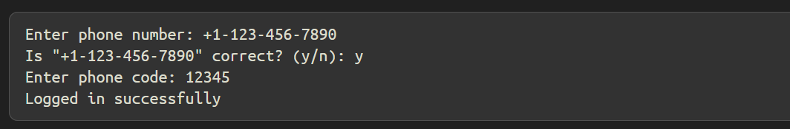
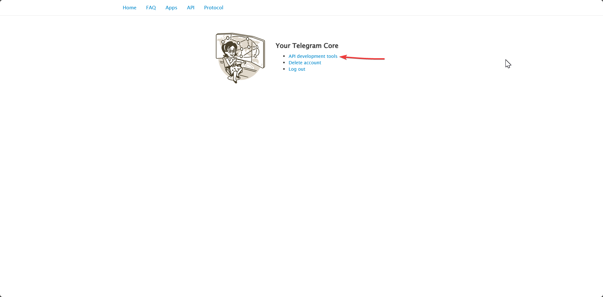
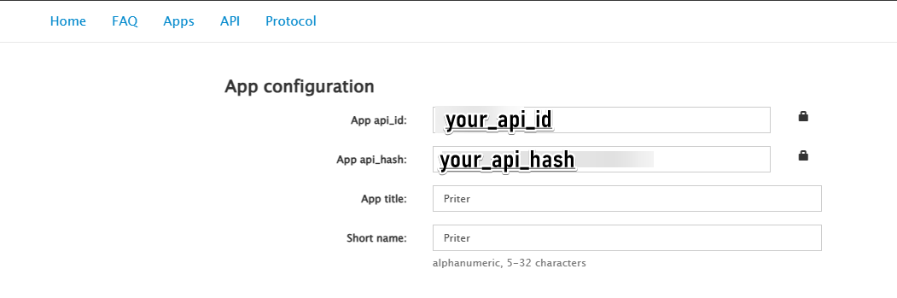

##  
    #RUS:
    #Если у вас не сработает код, удалите тот код ↑
    #и напишите этот код ↓
    #Потом у вас выйдет в терминале регистрация
    #Можете посмотреть на фотке Registracia

    #ENG:
    #If the code does not work for you, remove this code ↑
    #and write this code↓
    #Then you will see login in the terminal
    #You can look at the photo Registracia

↓↓↓↓↓↓↓↓↓↓↓↓↓↓↓↓↓↓↓↓↓↓↓↓↓↓↓↓↓↓↓↓↓↓↓↓↓↓↓↓↓↓↓↓↓↓↓↓↓↓↓↓↓↓↓↓↓↓↓↓↓↓↓↓↓↓↓↓↓↓↓↓↓↓

```python
from pyrogram import Client
api_id = "tour_api_id"
api_hash = "your ip hash"
app = Client("my_account", api_id=api_id, api_hash=api_hash)
app.run()
```
##
Registracia


##
   Свой api_id и api_hash вы можете найти по ссылке  => https://my.telegram.org/auth
   
my.telegram.org


AND

your api_id and hash
